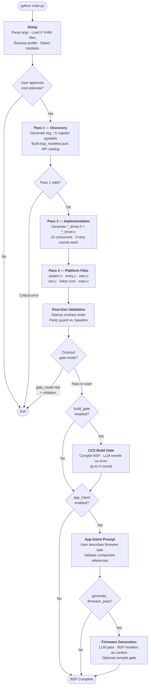

# BSP Generator — Runtime State Diagram

This document maps the complete runtime lifecycle of a single `python main.py` execution,
from startup through (optional) firmware generation and compile verification.

Paste any Mermaid code block below into [mermaid.live](https://mermaid.live) to render
an interactive diagram. Start from the first line of diagram code (e.g. `flowchart TD` or
`stateDiagram-v2`) and stop before the closing ` ``` ` fence.

---

## High-Level Overview

A bird's-eye view of the full pipeline. Use this for presentations and quick orientation.



---

## How to Read the Detailed Diagram

- **Rectangles** (`state X { }`) — composite states containing sub-states
- **`[*]`** — start or end pseudo-state
- **Arrows with labels** — transitions and their trigger conditions
- **Notes** (`note right of X`) — describe key decisions or side effects
- **Parallel states** (`--`) — concurrent execution within a composite state

---

## Detailed State Diagram

```mermaid
stateDiagram-v2
    direction TB

    [*] --> Startup

    %% ─────────────────────────────────────────────────────────────────────
    %% STARTUP
    %% ─────────────────────────────────────────────────────────────────────
    state Startup {
        [*] --> RegisterSignalHandlers
        RegisterSignalHandlers --> ParseCLIArguments
    }

    Startup --> ActionDispatch

    %% ─────────────────────────────────────────────────────────────────────
    %% ACTION DISPATCH
    %% ─────────────────────────────────────────────────────────────────────
    state ActionDispatch {
        [*] --> CheckActionFlag
        CheckActionFlag --> InteractiveMenu : no --action flag provided
        CheckActionFlag --> ActionResolved  : --action flag present
        InteractiveMenu --> ActionResolved  : user selects option
    }

    note right of ActionDispatch
        Menu options:
        1 = Full generation
        2 = Validate existing output
        3 = Post-gen prompt only
        4 = Post-gen prompt + firmware
        5 = Compile gate only
        6 = Docs only
        7 = Reflash board
    end note

    ActionDispatch --> YAMLLoading

    %% ─────────────────────────────────────────────────────────────────────
    %% YAML LOADING
    %% ─────────────────────────────────────────────────────────────────────
    state YAMLLoading {
        [*] --> LoadSocYaml
        LoadSocYaml --> LoadRegsYaml
        LoadRegsYaml --> LoadIrqYaml
        LoadIrqYaml --> LoadMemmapYaml
        LoadMemmapYaml --> LoadBusYaml
        LoadBusYaml --> LoadPinmuxYaml
        LoadPinmuxYaml --> LoadBoardYaml
        LoadBoardYaml --> LoadBringupContract
        LoadBringupContract --> CrossReferenceValidation
        CrossReferenceValidation --> [*] : all refs valid
        CrossReferenceValidation --> YAMLError : missing regs_ref / clock_ref / irq_ref
        YAMLError --> [*] : abort
    }

    note right of YAMLLoading
        All 9 YAML files must load
        and cross-validate before
        any generation begins.
        Abort on any critical error.
    end note

    YAMLLoading --> ProfileLoading

    %% ─────────────────────────────────────────────────────────────────────
    %% PROFILE LOADING
    %% ─────────────────────────────────────────────────────────────────────
    state ProfileLoading {
        [*] --> CheckNoProfileFlag
        CheckNoProfileFlag --> UseInCodeDefaults : --no-profile flag set
        CheckNoProfileFlag --> TryLoadProfileYaml : flag not set
        TryLoadProfileYaml --> MergeOverDefaults : generation_profile.yaml found
        TryLoadProfileYaml --> UseInCodeDefaults : file not found
        MergeOverDefaults --> [*]
        UseInCodeDefaults --> [*]
    }

    ProfileLoading --> PeripheralSelection

    %% ─────────────────────────────────────────────────────────────────────
    %% PERIPHERAL SELECTION
    %% ─────────────────────────────────────────────────────────────────────
    state PeripheralSelection {
        [*] --> CheckCLIModules
        CheckCLIModules --> CLIModulesAccepted   : --modules flag present
        CheckCLIModules --> CheckProfileModules  : no --modules flag
        CheckProfileModules --> ConfirmProfileModules : profile has modules.enabled list
        CheckProfileModules --> InteractiveModuleMenu : no profile modules
        ConfirmProfileModules --> ProfileModulesAccepted : user confirms Y
        ConfirmProfileModules --> InteractiveModuleMenu  : user declines N
        InteractiveModuleMenu --> ModuleConfirmation
        ModuleConfirmation --> InteractiveModuleMenu : user rejects selection
        ModuleConfirmation --> SelectionAccepted : user confirms
        CLIModulesAccepted --> SelectionAccepted
        ProfileModulesAccepted --> SelectionAccepted
        SelectionAccepted --> [*]
    }

    note right of PeripheralSelection
        CORE modules are always included:
        SYSTEM, PCR, IOMM, PLL, VIM
        These cannot be deselected.
        SCI uses a separate baud-rate path.
    end note

    PeripheralSelection --> CostEstimation

    %% ─────────────────────────────────────────────────────────────────────
    %% COST ESTIMATION + USER GATE
    %% ─────────────────────────────────────────────────────────────────────
    state CostEstimation {
        [*] --> ComputeTokenEstimate
        ComputeTokenEstimate --> DisplayCostSummary
        DisplayCostSummary --> WaitForApproval
        WaitForApproval --> Approved  : user presses Y / --yes flag
        WaitForApproval --> Rejected  : user presses N
        Approved --> [*]
        Rejected --> [*]
    }

    CostEstimation --> Pass1Discovery    : approved
    CostEstimation --> [*]               : rejected

    %% ─────────────────────────────────────────────────────────────────────
    %% PASS 1 — DISCOVERY
    %% ─────────────────────────────────────────────────────────────────────
    state Pass1Discovery {
        [*] --> SliceRegsYaml
        SliceRegsYaml --> BuildDiscoveryPrompt
        BuildDiscoveryPrompt --> InvokeBedrockPass1
        InvokeBedrockPass1 --> ParseFileDelimiters
        ParseFileDelimiters --> WriteRegHeaders
        WriteRegHeaders --> ValidatePass1Output
        ValidatePass1Output --> UpdateBspManifest   : validation passed
        ValidatePass1Output --> Pass1CriticalError  : critical error
        UpdateBspManifest --> [*]
        Pass1CriticalError --> [*]                  : abort run
    }

    note right of Pass1Discovery
        Runs for: CORE + USER modules
        Output per module:
          include/reg_<name>.h
        Final output: bsp_manifest.json
        Validates: base addresses,
        FACTS MIRROR, header guards
    end note

    Pass1Discovery --> Pass2Implementation

    %% ─────────────────────────────────────────────────────────────────────
    %% PASS 2 — IMPLEMENTATION
    %% (runs concurrently per module, semaphore = 15)
    %% ─────────────────────────────────────────────────────────────────────
    state Pass2Implementation {
        [*] --> Pass2PerModule

        state Pass2PerModule {
            [*] --> BuildDriverHPrompt
            BuildDriverHPrompt --> InvokeBedrockDriverH
            InvokeBedrockDriverH --> WriteDriverHeader
            WriteDriverHeader --> InjectDependencyContext
            InjectDependencyContext --> BuildDriverCPrompt
            BuildDriverCPrompt --> InvokeBedrockDriverC
            InvokeBedrockDriverC --> WriteDriverSource
            WriteDriverSource --> PostprocessCode
            PostprocessCode --> ValidatePass2Output

            state ValidatePass2Output {
                [*] --> CheckAPIContracts
                CheckAPIContracts --> CheckPLLSequenceOrder
                CheckPLLSequenceOrder --> CheckIommLockDiscipline
                CheckIommLockDiscipline --> Pass2Valid   : all checks pass
                CheckIommLockDiscipline --> Pass2Invalid : any check fails
            }

            Pass2Valid --> [*]

            Pass2Invalid --> ContractAutoFix
            ContractAutoFix --> InvokeBedrockAutoFix
            InvokeBedrockAutoFix --> RevalidateAfterFix
            RevalidateAfterFix --> Pass2Valid   : fixed
            RevalidateAfterFix --> RetryExhausted : still failing after 3 rounds
            RetryExhausted --> [*]              : module marked failed, run continues
        }
    }

    note right of Pass2Implementation
        Up to 15 modules run concurrently.
        Each module budget: 3 retry rounds.
        Dependency headers injected per module
        so LLM knows peer API signatures.
        FACTS MIRROR required before first file.
    end note

    Pass2Implementation --> Pass3Platform

    %% ─────────────────────────────────────────────────────────────────────
    %% PASS 3 — PLATFORM FILES
    %% (all 6 generated in parallel)
    %% ─────────────────────────────────────────────────────────────────────
    state Pass3Platform {
        [*] --> PlatformParallel

        state PlatformParallel {
            [*] --> GenSystem
            [*] --> GenEntry
            [*] --> GenStartupAsm
            [*] --> GenVIM
            [*] --> GenLinker
            [*] --> DepResolution

            GenSystem     --> PlatformDone
            GenEntry      --> PlatformDone
            GenStartupAsm --> PlatformDone
            GenVIM        --> PlatformDone
            GenLinker     --> PlatformDone

            DepResolution --> GenMainC
            GenMainC      --> PlatformDone

            PlatformDone --> [*]
        }
    }

    note right of Pass3Platform
        system.c  — PCR / CLKENA
        entry.c   — reset handler
        start.s   — stacks, FPU, MPU, TCM
        vim.c     — ISR vector table
        linker.cmd — from memmap.yaml
        main.c    — topological sort,
                    NO LLM (deterministic)
    end note

    Pass3Platform --> PostGenValidation

    %% ─────────────────────────────────────────────────────────────────────
    %% POST-GENERATION VALIDATION
    %% ─────────────────────────────────────────────────────────────────────
    state PostGenValidation {
        [*] --> RunStartupContractValidator
        RunStartupContractValidator --> StartupContractPassed : contract satisfied
        RunStartupContractValidator --> StartupContractFailed : contract violated

        StartupContractFailed --> CheckGateMode
        CheckGateMode --> WarnAndContinue : gate_mode = warn
        CheckGateMode --> AbortRun        : gate_mode = fail
        WarnAndContinue --> RunParityGuard
        StartupContractPassed --> RunParityGuard

        RunParityGuard --> ParityGuardDone
        ParityGuardDone --> [*]

        AbortRun --> [*]
    }

    note right of PostGenValidation
        Startup contract checks:
          - PCR → IOMM → PLL → VIM order
          - CLKCNTL written before GHVSRC
        Parity guard produces a diff
        report against known-good baseline.
    end note

    PostGenValidation --> BuildGateCheck

    %% ─────────────────────────────────────────────────────────────────────
    %% CCS BUILD GATE
    %% ─────────────────────────────────────────────────────────────────────
    state BuildGateCheck {
        [*] --> CheckBuildGateEnabled
        CheckBuildGateEnabled --> TIPreCorrections : enabled
        CheckBuildGateEnabled --> BuildGateSkipped : disabled

        TIPreCorrections --> CCSCompile
        CCSCompile --> CompileSuccess  : no errors
        CCSCompile --> CompileErrors   : errors detected

        CompileErrors --> LLMRewriteFiles
        LLMRewriteFiles --> CCSCompile  : retry (round ≤ 4)
        LLMRewriteFiles --> BuildFailed : round > 4

        CompileSuccess --> BuildGateSkipped
        BuildFailed    --> BuildGateSkipped
        BuildGateSkipped --> [*]
    }

    note right of BuildGateCheck
        mode: strict  → any error fails
        mode: advisory → warnings ok
        mode: off     → skip
        LLM targets only the files
        referenced in compiler errors.
    end note

    BuildGateCheck --> BoardCapabilityManifest

    %% ─────────────────────────────────────────────────────────────────────
    %% BOARD CAPABILITY MANIFEST
    %% ─────────────────────────────────────────────────────────────────────
    state BoardCapabilityManifest {
        [*] --> ReadBoardYaml
        ReadBoardYaml --> ReadBspManifest
        ReadBspManifest --> BuildComponentMap
        BuildComponentMap --> WriteBoardCapabilityJson
        WriteBoardCapabilityJson --> WriteBoardCapabilitiesHeader
        WriteBoardCapabilitiesHeader --> [*]
    }

    note right of BoardCapabilityManifest
        Maps board component names
        (LED2, S3, SCI_TERMINAL) to
        concrete BSP driver API calls.
        This is the vocabulary for the
        firmware intent prompt.
    end note

    BoardCapabilityManifest --> AppIntentStage

    %% ─────────────────────────────────────────────────────────────────────
    %% FIRMWARE GENERATION FROM USER PROMPT
    %% ─────────────────────────────────────────────────────────────────────
    state AppIntentStage {
        [*] --> CheckAppIntentEnabled
        CheckAppIntentEnabled --> PromptUserForIntent  : app_intent.enabled = true
        CheckAppIntentEnabled --> AppIntentSkipped     : disabled

        PromptUserForIntent --> ValidateIntentComponents
        ValidateIntentComponents --> IntentRejected    : unknown component refs
        ValidateIntentComponents --> IntentAccepted    : all components in manifest

        IntentRejected --> PromptUserForIntent         : re-prompt with valid component list

        IntentAccepted --> CheckFirmwareGenEnabled
        CheckFirmwareGenEnabled --> FirmwareGenPass    : generate_firmware_pass = true
        CheckFirmwareGenEnabled --> AppIntentSkipped   : prompt-only mode

        state FirmwareGenPass {
            [*] --> EmbedBspHeadersAsContext
            EmbedBspHeadersAsContext --> BuildFirmwareGenPrompt
            BuildFirmwareGenPrompt --> InvokeBedrockFirmware
            InvokeBedrockFirmware --> ParseFirmwareFiles
            ParseFirmwareFiles --> WriteFirmwareSource
            WriteFirmwareSource --> [*]
        }

        FirmwareGenPass --> FirmwareCompileGate

        state FirmwareCompileGate {
            [*] --> CheckFirmwareBuildGate
            CheckFirmwareBuildGate --> FirmwareCCSCompile  : enabled
            CheckFirmwareBuildGate --> FirmwareGateSkipped : disabled
            FirmwareCCSCompile --> FirmwareCompileOK    : no errors
            FirmwareCCSCompile --> FirmwareCompileErr   : errors
            FirmwareCompileErr --> LLMRewriteFirmware
            LLMRewriteFirmware --> FirmwareCCSCompile   : retry (round ≤ 4)
            LLMRewriteFirmware --> FirmwareGateFailed   : round > 4
            FirmwareCompileOK   --> FirmwareGateSkipped
            FirmwareGateFailed  --> FirmwareGateSkipped
            FirmwareGateSkipped --> [*]
        }

        FirmwareCompileGate --> AppIntentSkipped
        AppIntentSkipped --> [*]
    }

    note right of AppIntentStage
        intent_refs_mode = proven_only:
          only components with generated
          drivers are allowed references.
        BSP driver headers are embedded
        as full context for the LLM.
        No heap allocation permitted
        in generated firmware.
    end note

    AppIntentStage --> DocsGeneration

    %% ─────────────────────────────────────────────────────────────────────
    %% DOCS GENERATION (OPTIONAL)
    %% ─────────────────────────────────────────────────────────────────────
    state DocsGeneration {
        [*] --> CheckDocsEnabled
        CheckDocsEnabled --> RunDoxygen : docs enabled or --action docs_only
        CheckDocsEnabled --> DocsSkipped : docs not requested
        RunDoxygen --> DocsSkipped
        DocsSkipped --> [*]
    }

    DocsGeneration --> [*]
```



---

## State Summary Table

| State | Module | Key Outputs | Can Abort? |
|-------|--------|-------------|-----------|
| `YAMLLoading` | `yaml_utils.py` | Validated data structures | Yes — critical YAML errors |
| `ProfileLoading` | `main.py` | Merged generation profile | No — falls back to defaults |
| `PeripheralSelection` | `utils/user.py` | Confirmed module list | No — loops until confirmed |
| `CostEstimation` | `token_strategy.py` | Token estimate + cost preview | Yes — user rejects |
| `Pass1Discovery` | `generation/discovery.py` | `reg_*.h`, `bsp_manifest.json` | Yes — critical validation error |
| `Pass2Implementation` | `generation/implementation.py` | `*_driver.h`, `*_driver.c` | Partial — failed modules continue |
| `Pass3Platform` | `main.py` (parallel) | `system.c`, `entry.c`, `start.s`, `vim.c`, `linker.cmd`, `main.c` | No |
| `PostGenValidation` | `validation/` | Validation reports, parity diff | Yes — gate_mode = fail |
| `BuildGateCheck` | `build/ccs_build_gate.py` | Compiled binary (if successful) | No — failures logged |
| `BoardCapabilityManifest` | `intent/board_capabilities.py` | `board_capability_manifest.json`, `board_capabilities.h` | No |
| `AppIntentStage` | `intent/post_generation_prompt.py` | `firmware_main.c` (if enabled) | No — skipped if disabled |
| `DocsGeneration` | Doxygen (external) | `docs/html/` | No — skipped if disabled |

---

## Key Decision Points

```
┌─────────────────────────────────────────────────────────────────────────┐
│  DECISION                     BRANCHES                                 │
├─────────────────────────────────────────────────────────────────────────┤
│  --action flag present?       No  → Interactive menu                   │
│                               Yes → Skip menu                           │
├─────────────────────────────────────────────────────────────────────────┤
│  --modules flag present?      No  → Check profile → interactive menu   │
│                               Yes → Use directly                        │
├─────────────────────────────────────────────────────────────────────────┤
│  User approves cost?          No  → Exit                               │
│                               Yes → Begin Pass 1                        │
├─────────────────────────────────────────────────────────────────────────┤
│  Pass 1 critical error?       Yes → Abort                              │
│                               No  → Continue to Pass 2                  │
├─────────────────────────────────────────────────────────────────────────┤
│  Pass 2 contract violation?   Retry (max 3) → auto-fix → continue      │
├─────────────────────────────────────────────────────────────────────────┤
│  Startup contract violated?   gate_mode=warn → continue with warning   │
│                               gate_mode=fail → abort                    │
├─────────────────────────────────────────────────────────────────────────┤
│  CCS build errors?            LLM rewrite → retry (max 4 rounds)       │
│                               Exhausted    → log failure, continue      │
├─────────────────────────────────────────────────────────────────────────┤
│  app_intent.enabled?          No  → skip firmware generation            │
│                               Yes → prompt user for intent              │
├─────────────────────────────────────────────────────────────────────────┤
│  Unknown component in intent? Re-prompt with valid component list       │
├─────────────────────────────────────────────────────────────────────────┤
│  generate_firmware_pass?      No  → intent captured only               │
│                               Yes → LLM generates firmware .c files     │
└─────────────────────────────────────────────────────────────────────────┘
```

---

*See [ARCHITECTURE.md](ARCHITECTURE.md) for the full technical architecture reference.*
